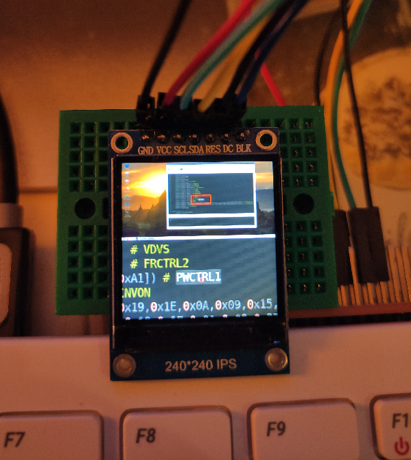
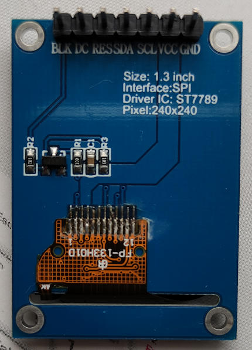

# micro-displays
Micro Displays for Raspberry Pi 
## Why?
_**I'm super bored in lockdown.**_ Add a Raspberry Pi 400 and a few tiny displays...

The top half of the micro display shows the full screen and the bottom half is a zoom centered around the mouse cursor.


Example of code editing using this set up :-)



## IPS 240x240

### Dependencies

Requires a couple of python libs:

```bash
$ pip3 install pyscreenshot
$ sudo apt install python3-xlib
```

### Testing

```bash
pi@raspberrypi:~ $ git clone https://github.com/igbit/micro-displays.git
Cloning into 'micro-displays'...
remote: Enumerating objects: 37, done.
remote: Counting objects: 100% (37/37), done.
remote: Compressing objects: 100% (37/37), done.
remote: Total 37 (delta 16), reused 0 (delta 0), pack-reused 0
Unpacking objects: 100% (37/37), done.
pi@raspberrypi:~ $ cd micro-displays/
pi@raspberrypi:~/micro-displays $ python3 main240x240.py
```
### Using without a monitor

When a monitor is not connected you must force the Raspberry Pi to output HDMI.

In /boot/config.txt make sure the following lines are uncommented:

```bash
max_framebuffers=2
hdmi_force_hotplug:0=1
hdmi_group:0=1
hdmi_mode:0=16 
```
See also https://www.raspberrypi.org/forums/viewtopic.php?f=28&t=243886#p1488488

### Start up on reboot

To enable at session startup on reboot:

```bash
pi@raspberrypi:~ $ cp /etc/xdg/lxsession/LXDE-pi/autostart /home/pi/.config/lxsession/LXDE-pi/
```

and add the following lines

```bash
@lxpanel --profile LXDE-pi
@pcmanfm --desktop --profile LXDE-pi
@xscreensaver -no-splash
@python3 /home/pi/micro-displays/main240x240.py 2>&1 >> /home/pi/micro-displays/stdout.log & 
```

(you probably only need to add the last one)

### Additional Display Info

* 1.3" 240x240 IPS / ST7789 Datasheet - google. I found these (not adding here as there are some disclaimers about redistribution): 
https://cdn.shopify.com/s/files/1/2386/9605/files/st7789v-lcd-controller-73f8bc3e.pdf?4396108893874243991
https://www.waveshare.com/wiki/File:ST7789_Datasheet.pdf



* 0.96" 80x160 IPS / ST7735 Datasheet - same, google: https://www.displayfuture.com/Display/datasheet/controller/ST7735.pdf

### Discussion in HackerNews

https://news.ycombinator.com/item?id=25566132

